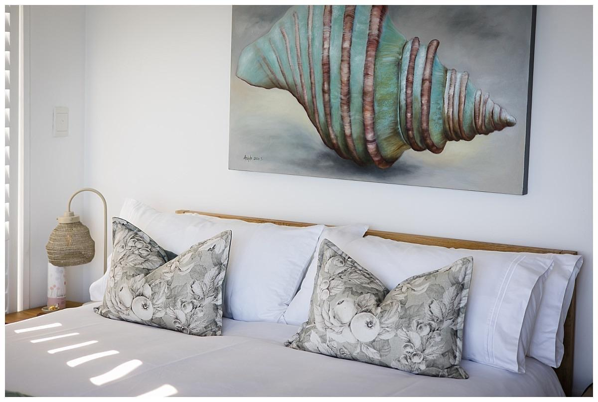
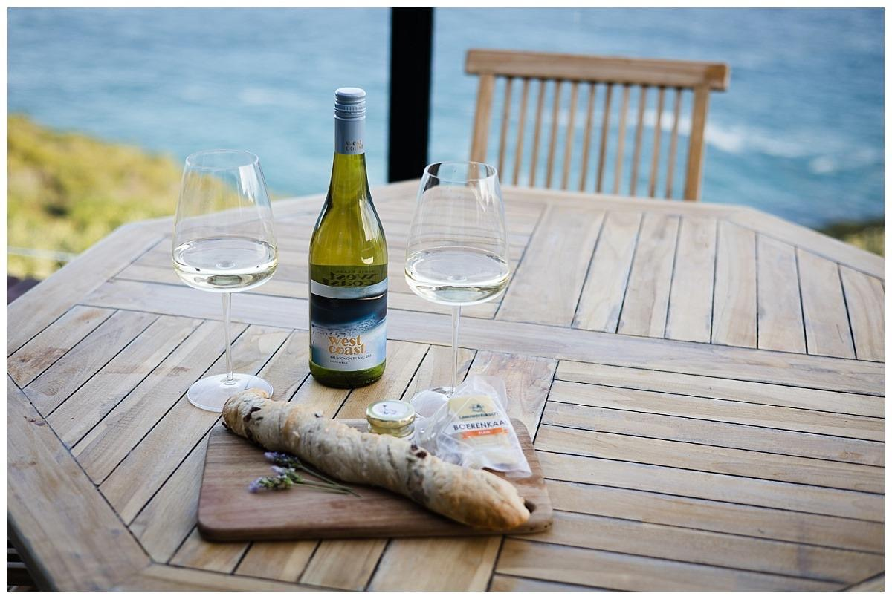
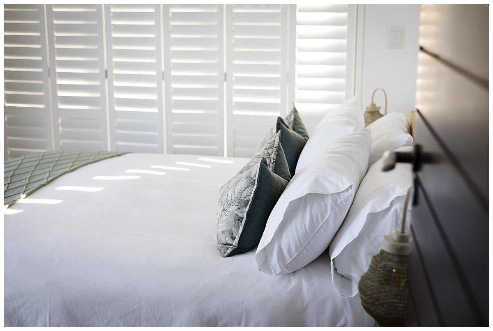
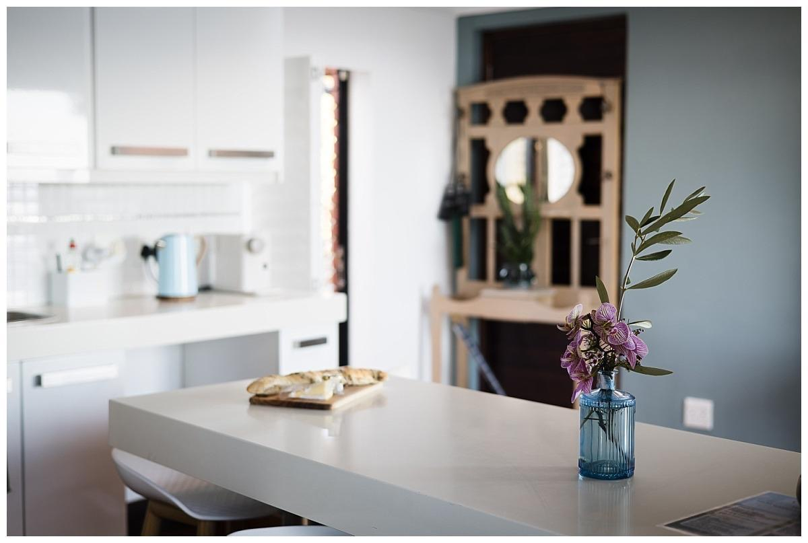
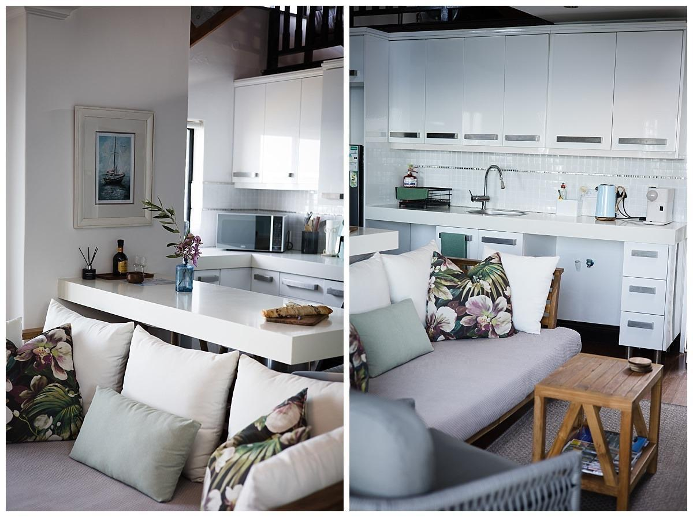
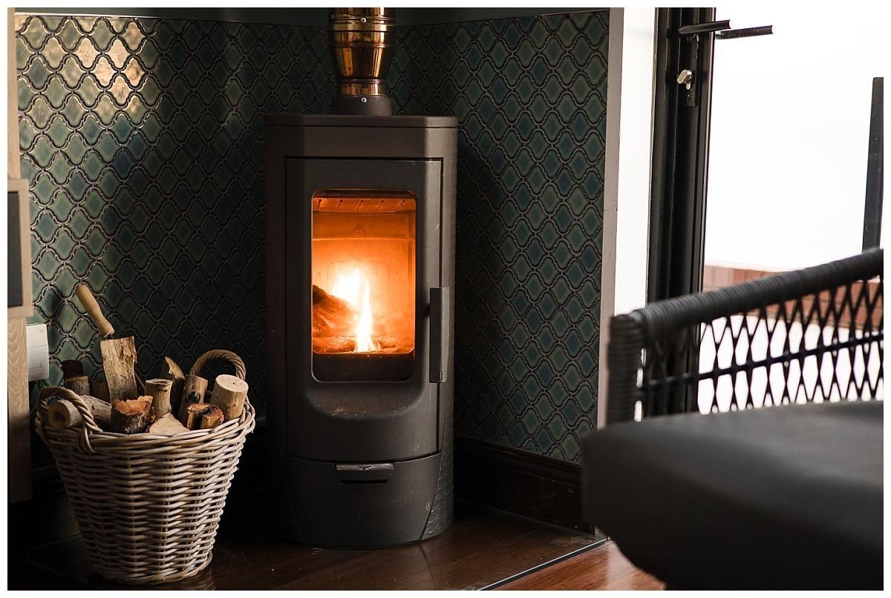

# Gallery Update Instructions

## Step 1: Replace the gallery HTML in index.html

Find this section (around line 48-76):
```html
        <div class="gallery-grid">
          <div class="gallery-item">
            <div class="gallery-placeholder gradient-1" aria-hidden="true"></div>
            <p class="gallery-label">Living Area</p>
          </div>
          ...
        </div>
```

Replace it with:
```html
        <div class="gallery-carousel">
          <div class="gallery-scroll">
            <div class="gallery-slide">
              
              <p>Living Area</p>
            </div>
            <div class="gallery-slide">
              
              <p>Master Bedroom</p>
            </div>
            <div class="gallery-slide">
              
              <p>Guest Bedroom</p>
            </div>
            <div class="gallery-slide">
              
              <p>Bathroom</p>
            </div>
            <div class="gallery-slide">
              
              <p>Kitchen</p>
            </div>
            <div class="gallery-slide">
              
              <p>Sea View Balcony</p>
            </div>
          </div>
        </div>
```

## Step 2: Replace the gallery CSS in assets/css/styles.css

Find this section and replace it:
```css
.gallery-grid {
  display: grid;
  grid-template-columns: repeat(3, 1fr);
  gap: 1rem;
  margin-bottom: 2.5rem;
}

.gallery-item {
  border-radius: var(--radius-md);
  overflow: hidden;
  border: 1px solid rgba(126, 92, 72, 0.2);
  box-shadow: 0 10px 24px rgba(74, 51, 38, 0.08);
  transition: transform 0.25s ease, box-shadow 0.25s ease;
}

.gallery-item:hover {
  transform: translateY(-4px);
  box-shadow: 0 14px 32px rgba(74, 51, 38, 0.12);
}

.gallery-placeholder {
  height: 200px;
  position: relative;
}

.gallery-label {
  padding: 0.8rem;
  font-size: 0.9rem;
  font-weight: 600;
  color: var(--text-ink);
  text-align: center;
  background: #fffaf3;
  border-top: 1px solid rgba(126, 92, 72, 0.14);
}
```

With:
```css
.gallery-carousel {
  margin-bottom: 2.5rem;
  width: 100%;
  overflow: hidden;
}

.gallery-scroll {
  display: flex;
  gap: 1rem;
  overflow-x: auto;
  scroll-behavior: smooth;
  padding: 1rem 0;
  -webkit-overflow-scrolling: touch;
}

.gallery-scroll::-webkit-scrollbar {
  height: 8px;
}

.gallery-scroll::-webkit-scrollbar-track {
  background: rgba(40, 33, 28, 0.08);
  border-radius: 4px;
}

.gallery-scroll::-webkit-scrollbar-thumb {
  background: var(--accent-rust);
  border-radius: 4px;
}

.gallery-scroll::-webkit-scrollbar-thumb:hover {
  background: var(--accent-deep);
}

.gallery-slide {
  flex: 0 0 320px;
  border-radius: var(--radius-md);
  overflow: hidden;
  border: 1px solid rgba(126, 92, 72, 0.2);
  box-shadow: 0 10px 24px rgba(74, 51, 38, 0.08);
  transition: transform 0.25s ease, box-shadow 0.25s ease;
}

.gallery-slide:hover {
  transform: translateY(-4px);
  box-shadow: 0 14px 32px rgba(74, 51, 38, 0.12);
}

.gallery-slide img {
  width: 100%;
  height: 220px;
  object-fit: cover;
  display: block;
}

.gallery-slide p {
  padding: 0.8rem;
  font-size: 0.9rem;
  font-weight: 600;
  color: var(--text-ink);
  text-align: center;
  background: #fffaf3;
  border-top: 1px solid rgba(126, 92, 72, 0.14);
  margin: 0;
}
```

## Step 3: Add placeholder images

Create 6 image files in `assets/images/`:
- living-area.jpg
- master-bedroom.jpg
- guest-bedroom.jpg
- bathroom.jpg
- kitchen.jpg
- balcony.jpg

You can temporarily use placeholder images from placekitten.com or similar services by updating src attributes if needed.
